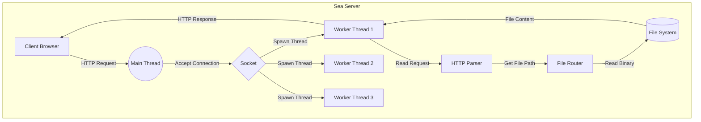

# 🌊 Sea Web Server


**Sea Web Server** is a lightweight, multithreaded HTTP web server built entirely from scratch using **C Language**.
This project demonstrates a deep understanding of **Socket Programming**, **Multi-threading**, and the **HTTP Protocol** without relying on any external web frameworks.

---

## 🏗 Architecture

The server adopts a **Multi-threaded** architecture to handle concurrent connections efficiently. The Main Thread acts as a dispatcher, while Worker Threads handle individual client requests independently.



---

## ✨ Key Features

- ⚡ **Multi-threading Support**: Utilizes `pthread` (Linux/macOS) and `WinAPI` (Windows) to handle multiple clients simultaneously without blocking.

- 🌍 **Cross-Platform**: Runs seamlessly on both Windows (Winsock2) and Unix-based systems (POSIX sockets).

- 📂 **Static File Serving**: Serves HTML, CSS, JS, and image files (JPG, PNG, ICO, etc.) with correct MIME types.

- 🛠 **Modular Design**: Codebase is refactored into distinct modules (`server`, `http`, `file`) for maintainability.

- 🚀 **Memory Management**: Handles dynamic memory allocation safely to prevent memory leaks and race conditions.

---

## 📂 Project Structure

```
sea/
├── include/           # Header files
│   ├── common.h       # Shared libraries & constants
│   ├── server.h       # Server core logic
│   ├── http.h         # MIME type handling
│   └── file.h         # File I/O operations
├── src/               # Source files
│   ├── main.c         # Entry point
│   ├── server.c       # Socket & Thread implementation
│   ├── http.c         # HTTP protocol implementation
│   └── file.c         # File serving implementation
├── www/               # Static resources (Web Root)
│   ├── index.html     # Landing page
│   └── sea.png        # Sample image
└── CMakeLists.txt     # Build configuration
```

---

## 🚀 Getting Started

**Prerequisites**

- C Compiler (GCC, Clang, or MSVC)

- CMake (Version 3.10 or higher)

**Installation & Run**

**1. Clone the repository**

```Bash
git clone [https://github.com/mfkim/sea.git](https://github.com/mfkim/sea.git)
cd sea
```

**2. Build the project**

```Bash
mkdir build
cd build
cmake ..
cmake --build .
```

**3. Run the server**

- Linux/macOS: `./sea`

- Windows: `sea.exe`

**4. Access in Browser** Open your browser and visit: http://localhost:8080

---

## 🧠 What I Learned
Through this project, I gained hands-on experience with:

- **Low-Level Networking**: Understanding TCP/IP handshake, `socket()`, `bind()`, `listen()`, and `accept()` system calls.

- **Concurrency**: Managing threads, race conditions, and non-blocking I/O.

- **HTTP Protocol**: Manually parsing HTTP headers and constructing compliant responses (`200 OK`, `404 Not Found`).

- **Cross-Platform Development**: Handling OS-specific APIs (`#ifdef _WIN32`) for maximum compatibility.

<p align="center"> Built with 🌊 by <strong>Mingu Kim</strong> </p>
